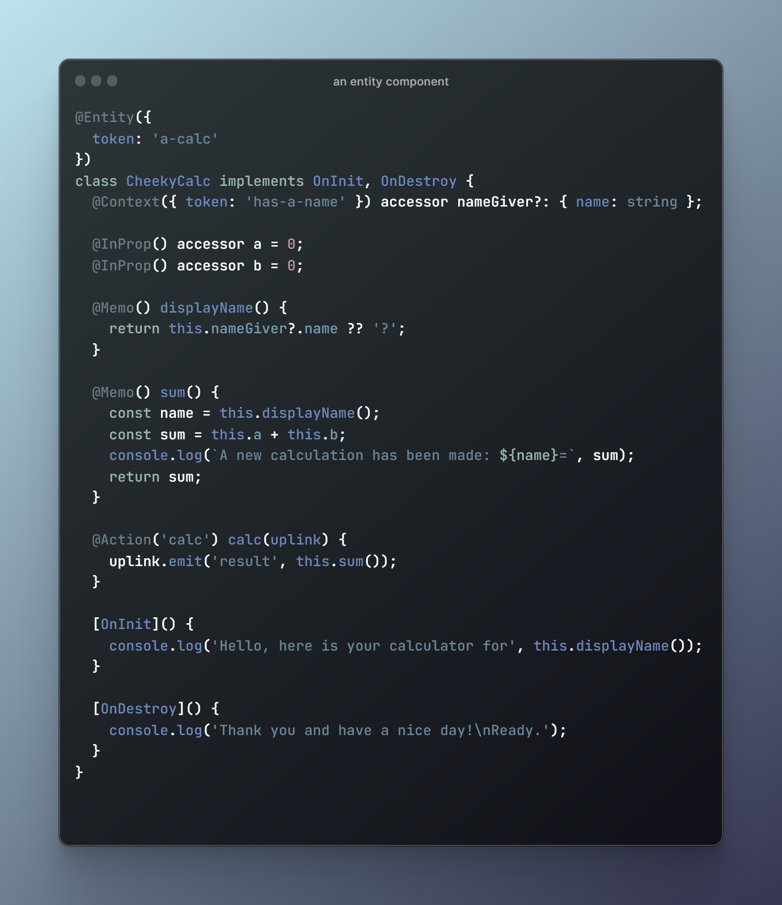

# @spearwolf/entity-verse

__Relocate your *workload intensive* components into web worker and communicate with them in your main thread by *hierarchical view entities*❗__

> a ~~framework~~ metaverse for your entities :rocket:

:warning: Attention!  The following content is more a sketch of ideas and tries to explore the vision of this framework. But by no means is this documentation complete or does it reflect the state of the implementation (for that you should better have a look at the test specs).

## Overview

the architecture of entity-verse is centered around four main sections:

1. [x] _entity components_ (your domain model)
2. [ ] _entity view objects_
   - [x] _javascript api_: bring your own framework: html, react, angular .. it's up to you
   - [ ] ready to use _web components api_
   - [ ] ready to use _react api_
3. [ ] create an _entity environment_ with a _kernel_
   - [ ] a worker env: all entities are living in a worker thread 
   - [x] a local env (runs on the browser main thread)
   - [x] but don't forget to _sync_ !
4. [ ] kernel entity/token routing
   - [x] an entity is not an entity component, but an entity can consists of multiple components
   - [x] entity component object creation based on a _registry_ and _tokens_

[👉 for a detailed description of what an entity is, see here](./docs/Entity.md)

### Entity Components

**entity-verse** provides the user with a decorator based api that can be used to create _entity components_.
an _entity component_ has the following properties:
- there are any number of input properties, aka `InProp`'s
- components can react to events and can trigger events themselves
- entity components have a _environment_: components have a parent-child relationship to each other and thus live in a classical tree-like hierarchy
  - a compoennt can be assigned to a parent component (but does not have to)
  - a component can have one, none or multiple child components
- all _in-props_ and _context_ accessors are __signals__ (using [spearwolf/signalize](https://github.com/spearwolf/signalize))
- there is a clearly defined lifecycle model with callbacks (which the user can use if needed)
  - the creation of the components is not done directly by the user, but indirectly via an entity _kernel_ (more about this later)



### Entity View

In order to use these entities, the user must create a _view instance_ for each entity. These frontends act as remote controllers for the actual entity.

```html
<entity-view token="has-a-name" name="foo">
   <entity-view id="calc" token="a-calc" a=100 b=1></entity-view>
</entity-view>

<script>
  const el = document.getElementById('calc');
  
  el.addEventListener('result', (e) => {
     console.log('result is', e.detail);
  });
  
  el.dispatchEvent(new CustomEvent('calc'));
</script>
```

If you do not want to use the predefined html elements (web components) which comes with this library, you can easily build your own view components with the javascript api:

```js
const nameGiver = new EntityView({token: 'has-a-name'});
nameGiver.setProperty('name', 'foo');

const myCalc = new EntityView([token: 'a-calc']);
myCalc.setProperty('a', 100);
myCalc.setProperty('b', 1);

nameGiver.addChild(myCalc);

myCalc.on('result', (result) => {
   console.log('result is', result);
})

myCalc.emit('calc');
```
