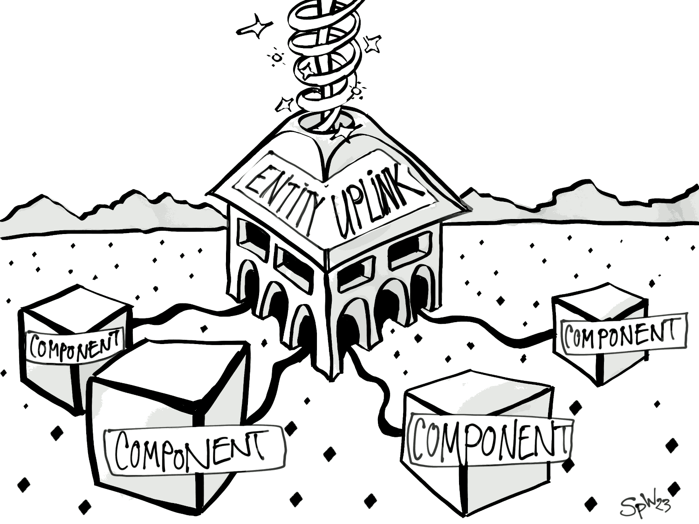

# What is an Entity ?

> An entity is more a concept than a concrete thing.

An entity ..

- has a _uuid_
- can have any properties
- can receive and send events
- an entity is created and destroyed by the _kernel_.
- when an entity is created is controlled by the _view_.
- has an _uplink_. This _uplink_ is the interface to the outside world. Properties and events are synchronized here.
- the _entity components_ are attached to this _uplink_. If an _entity uplink_ receives an event, this is automatically passed on to all attached components.
- if a component wants to use properties of the entity, a _signal connection_ is made between the component and the entity property (which is linked in the uplink). 
- which _components_ are generated for an _entity_ depends on the _token_. Based on the _token_ - which is specified when creating the _entity view object_ - the _kernel_ then decides which component instances are created for the entity.
